#### What is the difference between:
CMD: 
  - default command 
  - can it change when container running
  - can use default args

ENTRYPOINT:
   - main command
   - usually fixed
   - use when need conatiner do task
-----
### 1
#### Run the container hello-world
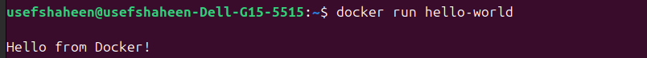

#### Check container status
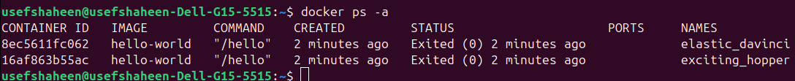

#### Start the stopped container
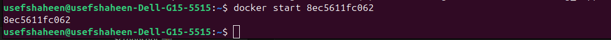

#### Remove the container
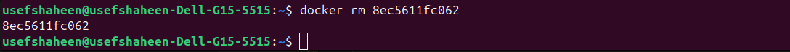

#### Remove the image
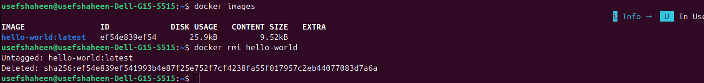

-----
### 2
#### Run container centos or ubuntu in an interactive mode
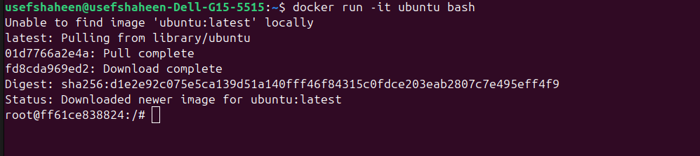

#### Run the following command in the container “echo docker ”
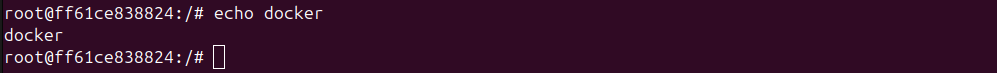

#### Open a bash shell in the container and touch a file named hello-docker
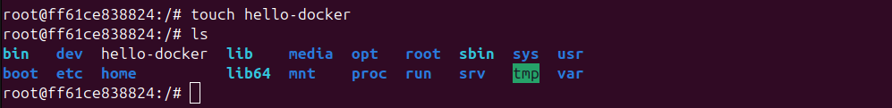

#### Exit container
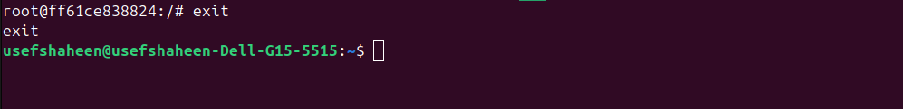

#### Stop the container and remove it. Write your comment about the file hello-docker
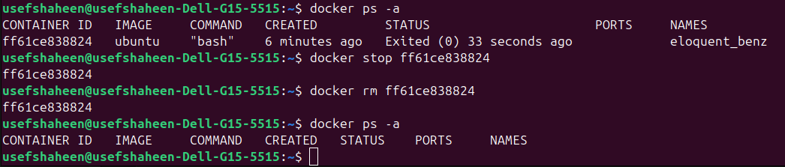

Once i remove the conainer the file is deleted.

#### Remove all stopped containers
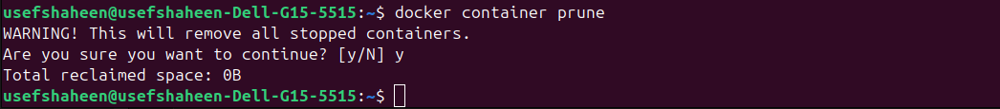

-----
### 3
#### Deploy a MySQL database called app-database. Use the mysql latest image, and use the -e flag to set MYSQL_ROOT_PASSWORD to P4sSw0rd0!. The container should run in the background.

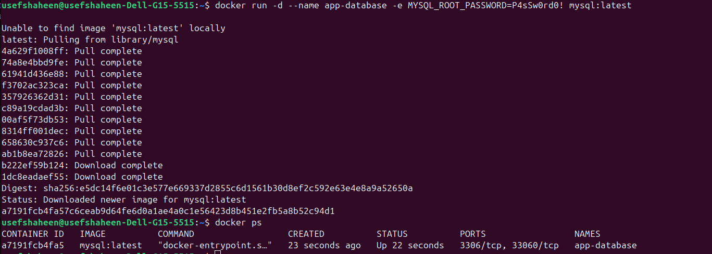

-----
### 4
#### Run nginx
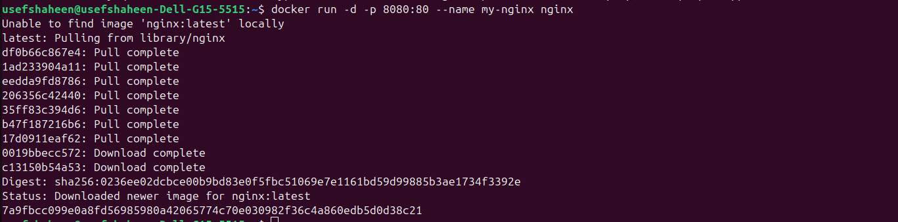
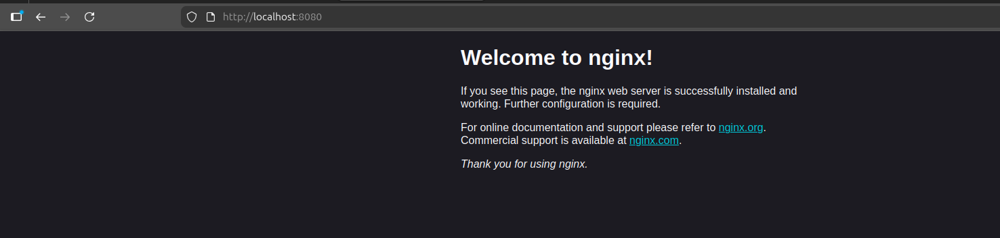

#### Add html static files to the container and make sure they are accessible

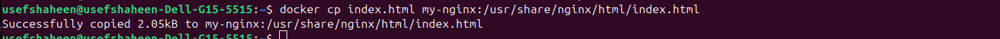
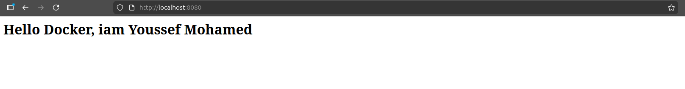

#### Commit the container with image name IMAGE_NAME
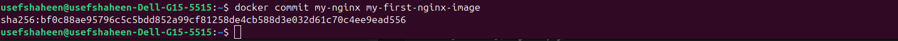

-----
### 5
#### Create a python simple app
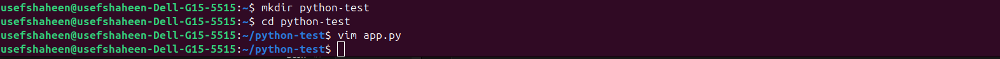
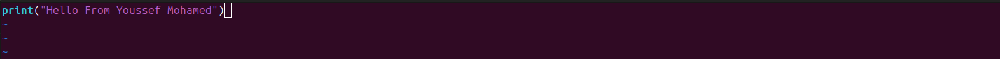

#### Create a dockerfile to containerize the python app
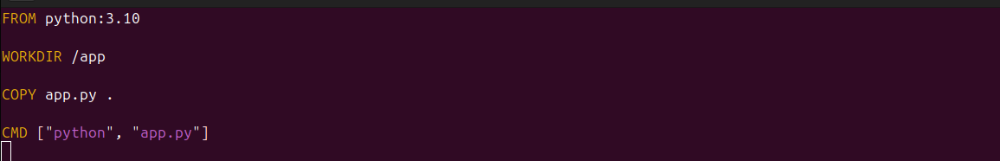

#### Build the image and test it
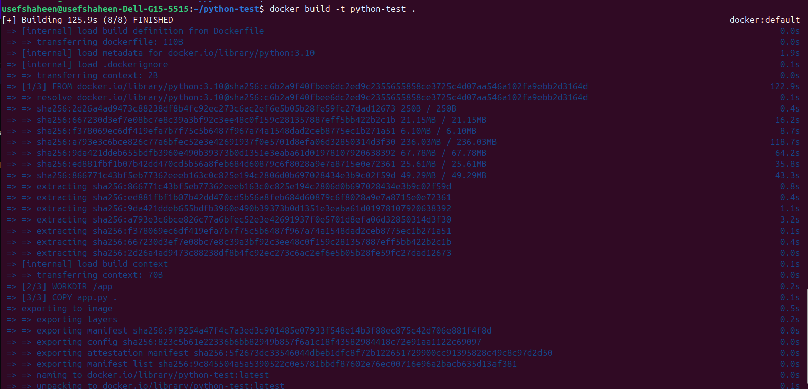
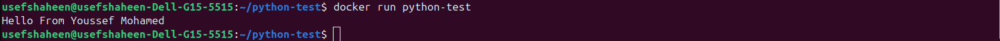

#### Push the created image into your docker hub repo
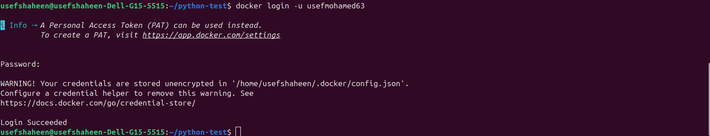
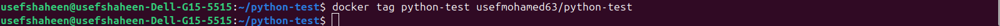
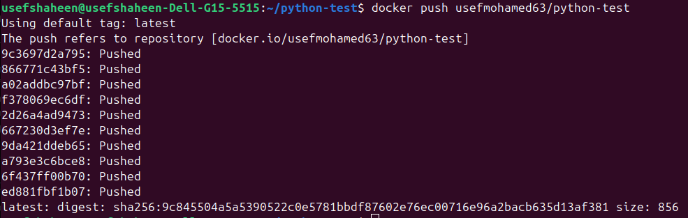
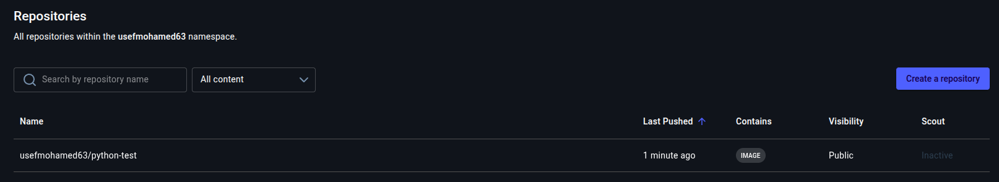
