### 1
#### Run a container nginx with name my-nginx and attach 2 volumes to the container using volume mount 
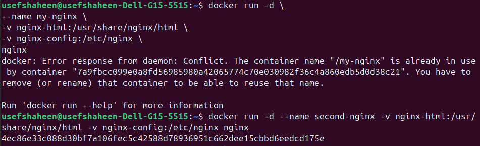

#### Volume1 for containing static html file
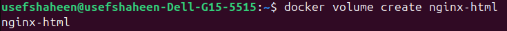

#### Volume2 for containing nginx configuration
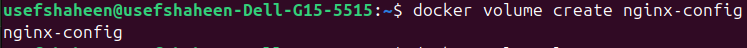

#### Edit the html content 
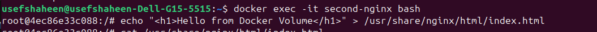

#### Remove the container 
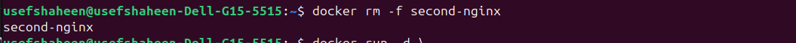

#### un a new 2 containers with the following:
#### o Attach the two volumes that were attached to the previous container
#### using volume mount
#### o Map port 80 to port 8080 on you host machine
#### o Access the html files from your browser
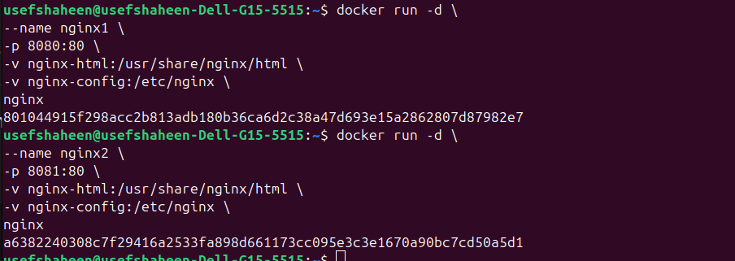
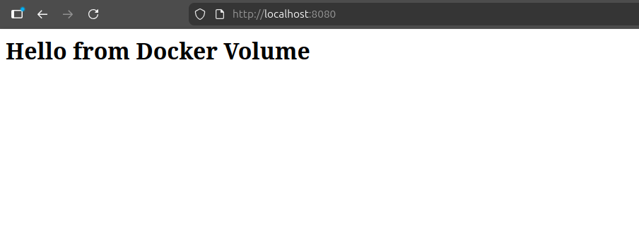
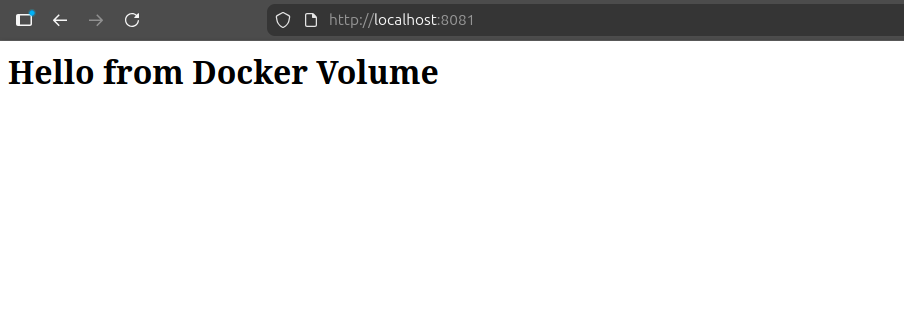

-----
### 2
#### Run a container Nginx with name nginx-bind-mount and attach 2 volumes using bind mount under any paths
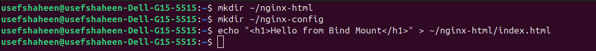
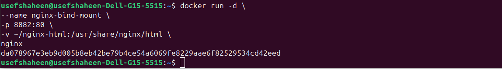
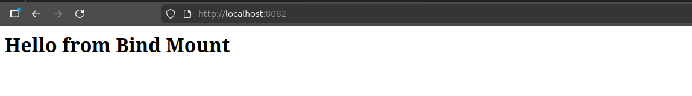
#### Remove the container 
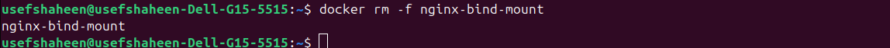

#### Run a new container with the following: 
####  o Attach the two volumes that were attached to the previous container
####  o Check the old data in the new containers
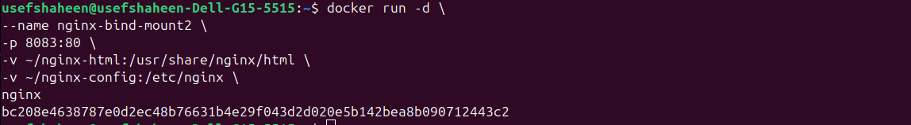
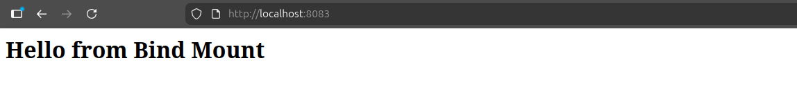