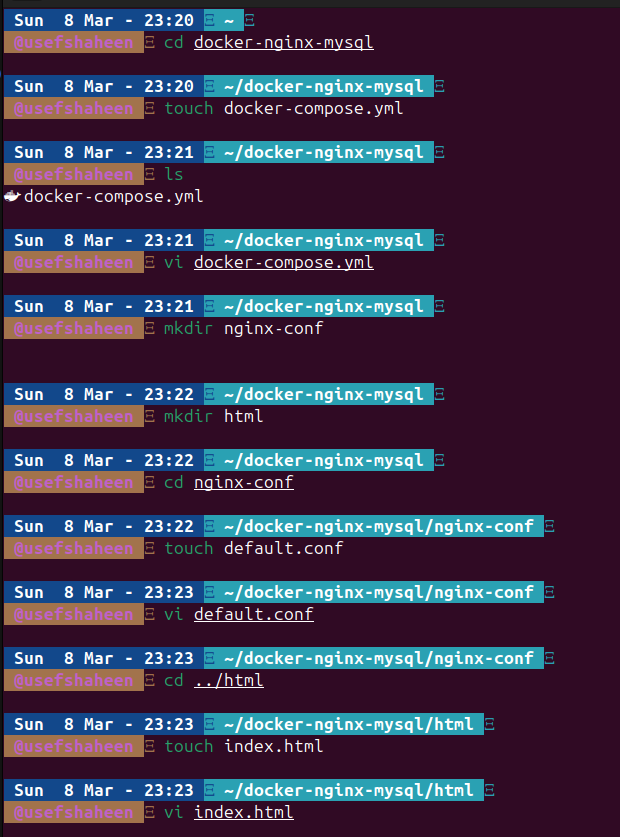
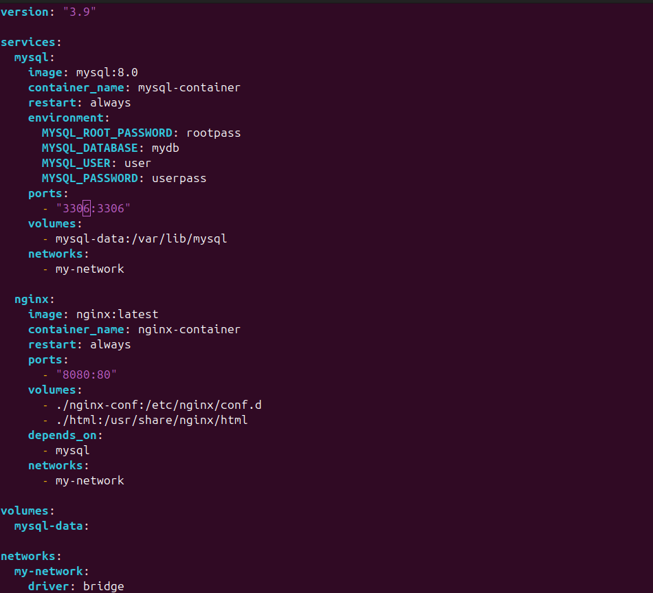
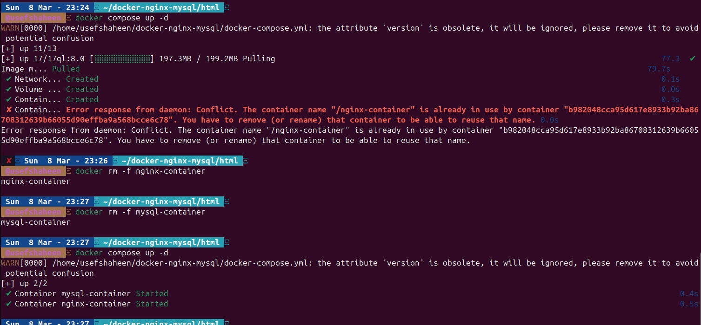
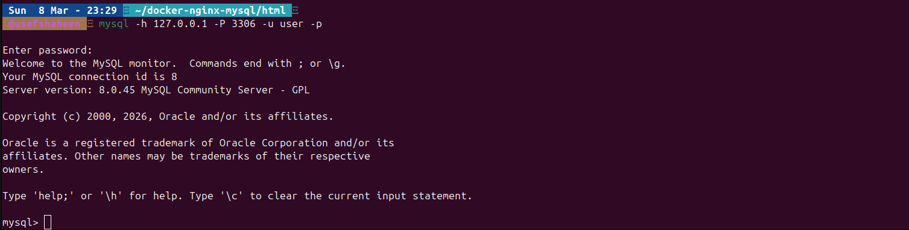
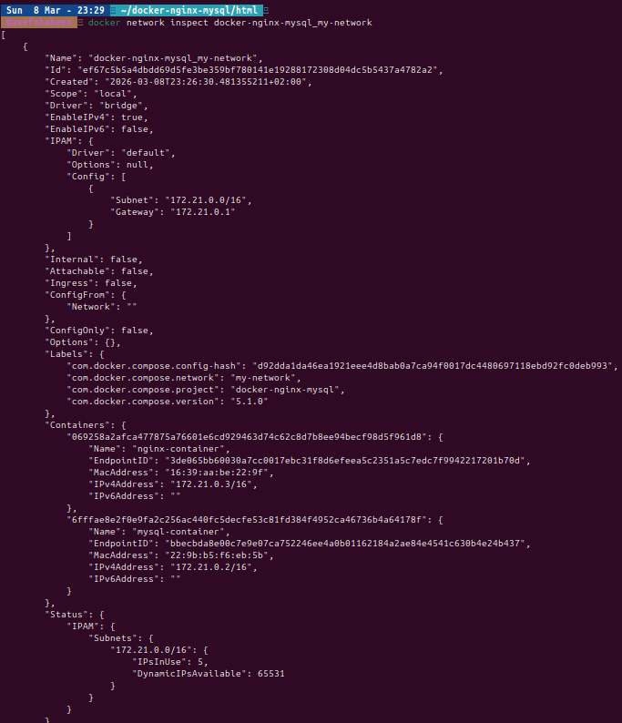
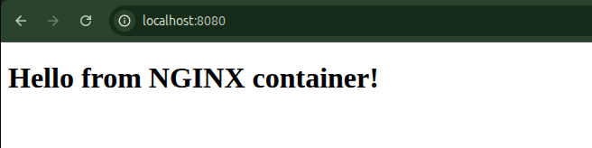
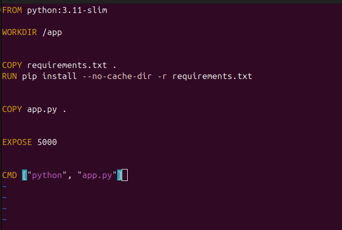
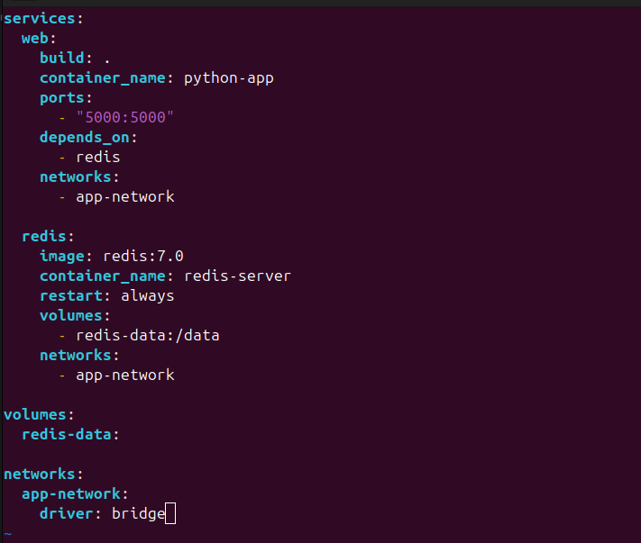
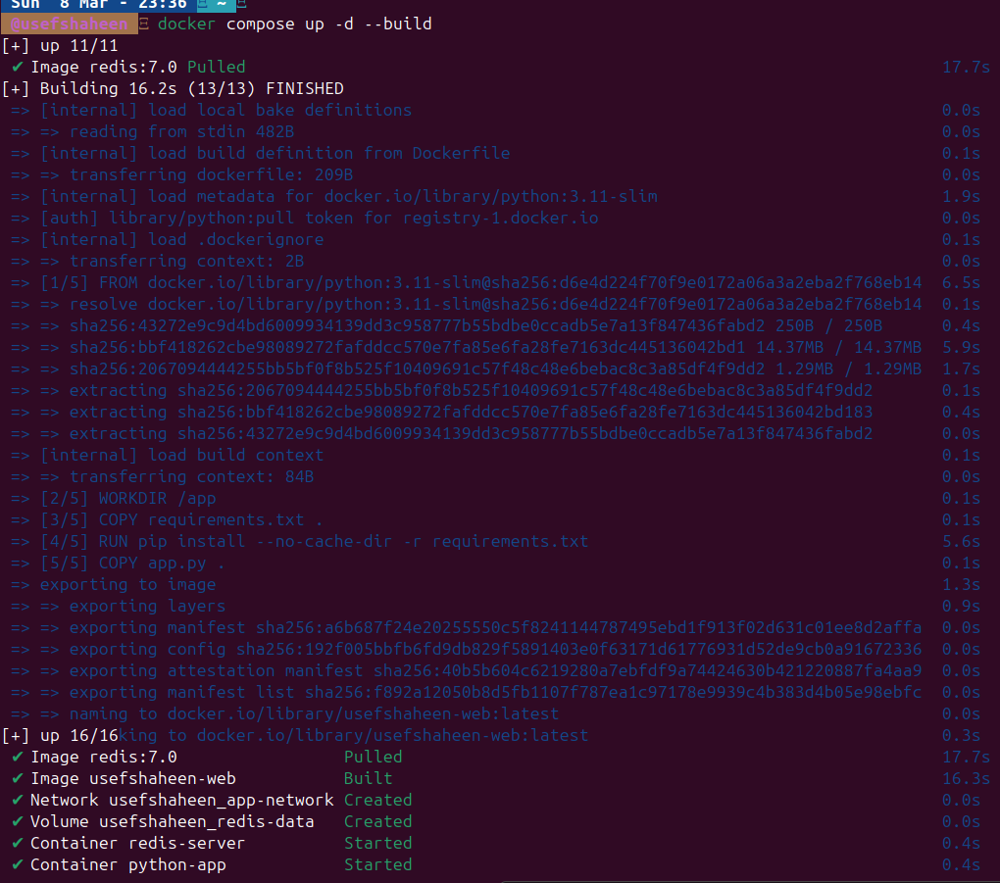
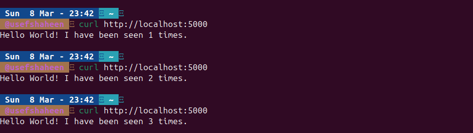

### Task 1
1. Create a project folder
2. Create docker-compose.yml
3. Create NGINX config folder and a simple config
4. Create a sample HTML page
5. Start Docker Compose
6. Test

-------------------------
### Task 2
1. Create requirements.txt
2. Create Dockerfile for the Python app
3. Create docker-compose.yml
4. Run Docker Compose
5. Test

